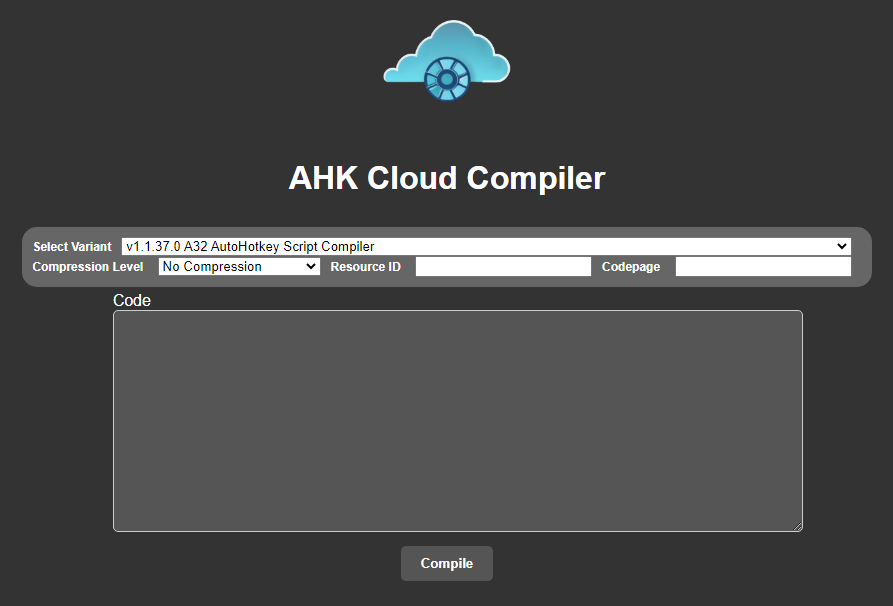

# AHK Cloud Compiler



This project is a web application that provides a GUI to compile AutoHotkey scripts to EXE files with various configurations. The project is built using Python Flask and uses the AutoHotkey Compiler (Ahk2Exe) to perform the compilation.

The application has support for various compression levels (no compression, MPRESS compression, and UPX compression), and different AHK variants. It also allows for specifying the codepage and resource ID. All these options can be selected through a form when submitting the code for compilation.

## Setup
1. Clone the repository.
2. Install the requirements using pip.
```
pip install -r requirements.txt
```
3. Set up your environment variables. The project uses a secret key that Flask uses for signing. Make sure to set the SECRET_KEY in config.py.
4. Start the server.
```
python app.py
```

## Configuration
You can configure some of the application's behavior through the `config.json` file.

Here's what each option does:

* `version`: The version of the config file.
    * `compile.count`: The number of times a compile operation has been performed. This is automatically incremented by the application.
    * `compile.remove_delay`: This is the delay (in seconds) before a compiled EXE file is deleted from the server. It doesn't take effect if compile.cache is enabled.
    * `compile.cache`: If this is set to true, the application will not delete the compiled EXE files, and if the same script is submitted for compilation, it will serve the cached EXE file.
    * `compile.cloudflag`: If this is set to true, the compiler will insert the flag at the top of the script with compile info and data, within the variable `A_CloudCompile` (time of compilation, AutoHotkey variant used, compression level, resource ID, codepage, etc.) `(Note: This feature is implemented but can't yet be turned off)`
* `footer`: If this is set to true, a footer will be added to the bottom of the webpage. `(Note: This feature is not yet implemented)`
* `captcha`: If this is set to true, the application will use captcha verification before compiling the script. `(Note: This feature is not yet implemented)`
You can modify these options as per your requirements.

## Footnotes
* This project is set up to be run on a Windows system because of its use of the AutoHotkey Compiler. The compiler will be run using wineconsole if the project is run on a non-Windows system, and set `os.environ["DISPLAY"] = ":0.0"` however it may require additional setup not covered in this README depending on your enviroment. It was breifly tested on Linux Mint 21 (Cinnamon) and Ubuntu Server 21 
* There are some stipulations as to which versions of AHK are supported by the most recent version of Ahk2Exe. tl;dr no 1.0 version are supported, for more information about those stipulations please see [here](https://github.com/AutoHotkey/Ahk2Exe/issues/98) 

## Dependencies
* flask
* flask_wtf

